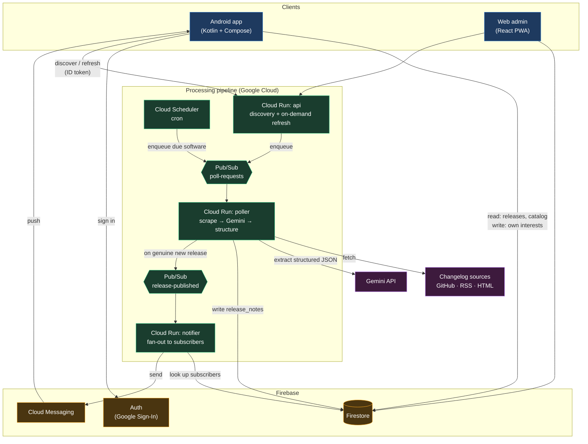

# Architecture

**Status:** target architecture for the native Android conversion.
**Last reviewed:** 2026-09-08.
Decisions behind this document live in [`adr/`](adr/). Where this file and an ADR
disagree, the ADR is the record and this file needs fixing.

---

## 1. The scaling insight everything follows from

Polling is **per-software**, not per-user.

Ten thousand users tracking FL Studio require **one** scrape of the FL Studio
changelog and **one** Gemini extraction — then ten thousand notifications. The
expensive work is `O(catalog)`. The cheap work is `O(subscribers)`.

The original PWA got this backwards: every user's browser hit `/api/proxy` and
called Gemini for themselves, on demand, by pressing a button. That is
`O(users × catalog)` — the same scrape and the same paid AI call repeated per
user. It works fine for one user and collapses at a thousand.

So the pipeline is built as a **fan-out**: schedule the catalog, process each item
once, fan the result out to subscribers.

---

## 2. System diagram



**Read the diagram as three claims:**

1. The Android app touches only Firebase and one authenticated API. It has no
   knowledge of Gemini, scraping, or the pipeline's existence.
2. Every expensive operation happens exactly once per software item, inside
   Cloud Run, behind a queue.
3. Notifications are a separate stage from processing, so a slow fan-out never
   blocks a scrape and a failed scrape never half-notifies.

---

## 3. Components

### 3.1 Android app (`android/`)

Kotlin, Jetpack Compose, MVVM with unidirectional data flow, Hilt for DI,
multi-module by feature. Offline-first: Room is the single source of truth for
the UI, and Firestore syncs into it.

```
UI (Compose)  →  ViewModel (StateFlow)  →  UseCase  →  Repository
                                                          ├── LocalDataSource  (Room)   ← UI always reads this
                                                          └── RemoteDataSource (Firestore) → writes into Room
```

The UI never observes Firestore directly. It observes Room. This is what makes
the app work on a train, and it means a Firestore outage degrades to stale data
rather than an empty screen. See
[ADR-0005](adr/0005-offline-first-room-cache.md).

**Module graph** — dependencies point downward only, never sideways between
features:

```
        :app
          │
   ┌──────┼───────┬──────────┬─────────┐
:feature:auth  :feature:dashboard  :feature:library  :feature:software  :feature:settings
   └──────┴───────┴──────────┴─────────┘
          │
     :core:data ──── :core:domain
       │   │
       │   └── :core:database (Room)
       │   └── :core:network  (Firestore, API client)
       │
   :core:designsystem ── :core:model ── :core:common
```

A feature module may never depend on another feature module. If two features need
the same thing, it belongs in `:core`. See
[ADR-0007](adr/0007-modularization-strategy.md).

### 3.2 Backend (`backend/`)

Three Cloud Run services. Cloud Run rather than Cloud Functions because scraping
a full version history plus several Gemini calls routinely exceeds the Functions
timeout, and because request concurrency makes Cloud Run dramatically cheaper
under load. See [ADR-0004](adr/0004-cloud-run-pubsub-pipeline.md).

| Service | Trigger | Job |
|---|---|---|
| `poller` | Pub/Sub `poll-requests` | Fetch sources by priority, call Gemini, write `release_notes`, publish to `release-published` on a genuine new version |
| `notifier` | Pub/Sub `release-published` | Resolve subscribers from `interests`, batch-send FCM, prune dead tokens |
| `api` | HTTPS (Firebase ID token) | Source discovery for new software, on-demand refresh enqueue, admin operations |

Pub/Sub sits between stages for three reasons: **backpressure** (5,000 catalog
items do not stampede the scrapers), **retries with a dead-letter queue** (a
flaky vendor site does not lose the job), and **decoupling** (deciding what to
poll is not the same concern as polling it).

### 3.3 Firestore

Nine collections. Full field-level schema in [`DATA_MODEL.md`](DATA_MODEL.md).
The security model — what the client may and may not write — is in
[`SECURITY.md`](SECURITY.md) and enforced in `firebase/firestore.rules`.

### 3.4 Web (`web/`)

The original React PWA, retained deliberately. Dense admin work — the registry
manager, the processing monitor, the insight data grids — belongs on a large
screen. Porting a `DataGrid` to a phone would be effort spent making something
worse. The Android app is the consumer surface; the web app is the operator
surface.

---

## 4. The polling pipeline in detail

**Source priority.** Each catalog entry carries an ordered list of source types.
The poller walks it and aggregates whatever it finds, rather than stopping at the
first hit — more context produces better extraction.

Default order: `github → rss → changelog/html`. Overridable per software by an
admin, because a vendor's RSS feed is sometimes better maintained than its GitHub
releases page (and sometimes catastrophically worse).

| Tier | Source | Notes |
|---|---|---|
| 1 | GitHub Releases API | Structured, reliable, rate-limited |
| 2 | Package registries | npm, PyPI, Maven — structured version data |
| 3 | RSS / Atom | Needs entity sanitisation; feeds are frequently malformed |
| 4 | HTML changelog | Heuristic scrape, then Gemini |
| 5 | Web search fallback | Gemini with search grounding, when everything above is empty |

**Extraction.** Raw aggregated text goes to Gemini with a strict schema and
explicit rules: extract technical version strings and never dates-as-versions,
categorise into a fixed enum, ignore dependency bumps and content packs, resolve
source disagreement as "highest version + most recent date".

**Genuine-update gate.** A release is only published to the notification stage if
the extracted version differs from `master_registry.lastVersion`. Without this
gate every scheduled poll notifies every user every time — the single fastest way
to get an app uninstalled.

**Self-correction.** Gemini returns a `metadataLearnings` object suggesting better
source URLs than the ones used. These are written to `system_learnings` and
applied to the catalog, so the registry improves as it runs.

---

## 5. Notification fan-out

1. Poller publishes `{softwareId, version, category}` to `release-published`.
2. Notifier queries `interests where softwareId == X` — this is why `interests`
   is indexed on `softwareId`.
3. For each subscriber, check their per-category notification preferences.
   A user who muted "Bug Fixes" does not get woken for a patch release.
4. Collect FCM tokens, send in batches of 500 (the FCM multicast limit).
5. Delete tokens that come back `UNREGISTERED`. Dead tokens accumulate forever if
   you never prune them.

See [ADR-0008](adr/0008-fcm-notification-fanout.md).

---

## 6. What is deliberately not here

- **No custom user database.** Firebase Auth owns identity. `users/{uid}` holds
  preferences, nothing that could be called a credential.
- **No GraphQL / REST CRUD layer.** The client reads Firestore directly. Adding
  an API in front of it would buy nothing and cost a hop; rules already do
  authorisation.
- **No on-device AI.** Discussed and rejected — see
  [ADR-0003](adr/0003-server-side-ai-and-polling.md).
- **No offline writes queue beyond Firestore's own.** The client's writes are
  small and rare (follow / unfollow / settings). Firestore's built-in offline
  persistence covers it.

---

## 7. Known weaknesses

Recorded honestly so nobody rediscovers them at 2am.

| Weakness | Impact | Mitigation |
|---|---|---|
| Gemini extraction is non-deterministic | Same input can yield a slightly different version string | Version normalisation before the genuine-update comparison; `release_notes` doc IDs are derived from the normalised version so re-extraction merges rather than duplicates |
| HTML scraping breaks when vendors redesign | Silent staleness for that software | `lastCheck` monitoring + `system_learnings`; a source that yields nothing N times in a row should be flagged for admin review (**not yet implemented**) |
| GitHub API rate limits | Large catalogs will hit the anonymous 60/hr limit | Authenticated token in the poller raises it to 5,000/hr (**not yet implemented**) |
| Firestore has no full-text search | Catalog search is prefix-matching only | Acceptable at current scale; Algolia or Typesense if it stops being |
| Gemini cost scales with catalog × frequency | Runaway bill risk | Poll frequency tiered by software popularity; cheap change-detection (ETag / content hash) before spending a Gemini call (**not yet implemented**) |

The "not yet implemented" items are tracked in [`STATUS.md`](STATUS.md).
